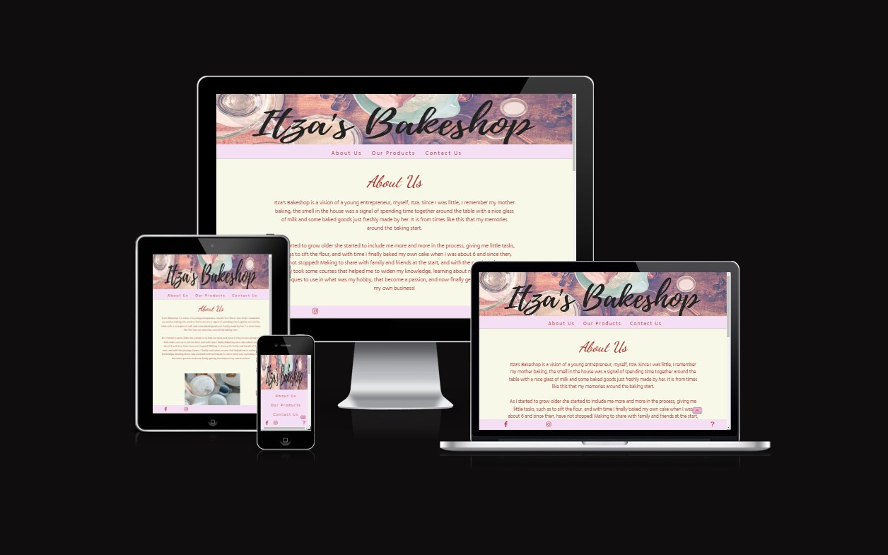

 
 
 

# Overview

### This website is targeted at clients who are specifically looking for home baked good, wether they are traditional, customized or for a special ocassion. It introduces Itza and their products to a wider online market.   
 
 

## The User

### The user will find in this site an option to cover their necessity of buying a cake or baked goods, whenever it is for a birthday, special occasion or everyday treat. 
 
 

## The Client

### The client will have a window to display examples of their work, through finished products that had been delivered previously. This display will help the client to expand their exposition and become an expansion to their market, which is the objective of the business growth plan.
 
 

## The site

### Itza's Bakeshop is a user-friendly, easily accessible business website, where will be displayed cakes and baked goods that can be purchased, and also provides the option to contact the client for special requests or other inquiries about the business.
 
 

# UX

### The typical client for this business is a person that is in looking for to purchase a cake or baked goods for special occasion or daily treat.
 
 

# Client stories

###	As a user, I want to have an easily navigated site.
###	As a user, I want to find a display that showcases their capability.
### As a user looking for a customized cake, I want to find a way to get in contact with them with a fast response.
###	As a user, I want to find information of how professional they are and how seriously they take their clients.
 
 

# Wireframes 

### [Desktop - About Us ](https://share.balsamiq.com/c/48xiNJfX2JnCPb9pPk8agW.png)    
### [Desktop - Our Products ](https://share.balsamiq.com/c/hc3Xs4sWEoVQbX43Z3E3VL.png)  
### [Desktop - Contact Us ](https://share.balsamiq.com/c/dcAAsdjFujED9rdicLcejd.png)  
### [Desktop - Thanks Message ](https://share.balsamiq.com/c/uMahGNJzkDLHNEUekbUZEv.png)  
### [Desktop - FAQS ](https://share.balsamiq.com/c/t3YAHigRozwTJsyM1ZfA3v.png)  

 

### [Mobile - About Us](https://share.balsamiq.com/c/3xqm8vRNDJLuqohht7jW8X.png)  
### [Mobile - Our Products](https://share.balsamiq.com/c/oycudDAbhJq9JBRktCDjEk.png)  
### [Mobile - Contact Us](https://share.balsamiq.com/c/gTeLbZQaUnR6VAaVCuhBVp.png)  

 
 

# Features

### Each page contains a head section, which includes an image with the business name and a nav menu that directs you to the three main pages. Also a footer where can be found the media links to Facebook and Instagram, also a help button that directs you to a new page with some FAQS. In each page, can be found a floating button that takes you to the heading section. It's located in the bottom right area and has an opacity attribute so it does not cover the page information. 
### The index page, home, is named "About Us".  It contains a paragraph with information about the business. Also an image with reference to the preparation of baked goods. 
### Next, we have a gallery, "Our Products", where some examples of the products are being displayed with a brief description of them.  
### Finally in the menu we have the "Contact Us" page, where the user can contact the client in order to realize a purchase or inquiry about the products.  
 
 

# Features left to implement

### In the future, is expected to add a slide of images with screenshots of clients reviews.
 
 

# Technology Used

### For this website had been use HTML and CSS languages. 
### While developing, DevTool had been used to find the correct target and attribute to implement. 
### For help the performance uploading the media, had been use Cloudinary.
### Also, had use fontawesome and google fonts for the font and icons.
 
 

# Funtionality 

### The actions expected from the nav and interactive links are working as planned.
### The display of the pages is showing as anticipated.
 
 

# Tested

### The HTML code as the CSS had been tested in W3C Validators.  
### While developing, DevTool had been used to find the correct target and attribute to implement. 
 

## CSS

### Report has come back clear, no errors or warnings to show.

    

     

## HTML

### Reports for the pages have come back clear, no errors or warnings to show.

 
 

# Responsiveness

### The site had been tested in various screen sizes as listed below.
 

### Mobile :

### 320x640 / 360x640 / 414x896 / 360x740

 

### Tablet :

### 768x1024 / 1280x800 / 962x601 / 810x1280

 

### Monitor :

### 1280x1024 / 1600x900 / 2560x1440 / 3440x1440 
 

### The site had been view in Chrome, Firefox and Safari without any noticeable problems.
 
 

# Deployment  

### The page had been deployed using GitHub pages, from the main branch.  
 

[Live Site](https://ivettemcdermott.github.io/PP1/)   
[Repo](https://github.com/IvetteMcDermott/PP1.git)
 
 

# Lighthouse

 
 

# Credits

### While no code had been copied from other sources for the building of this site I had relay in different sources and forums, as part of the research for develope of it as follow : 
  

### [Davidwells.io](https://davidwells.io/)  
### [Css-tricks.com](https://css-tricks.com/)  
### [Unicode-table.com](https://unicode-table.com/en/)  
### [kevinpowell.co](https://www.kevinpowell.co/)  
### [w3school.com](https://www.w3schools.com/)  
### [Geekforgeeks.org](https://www.geeksforgeeks.org/)  
### [Blog.logrocket.com](https://blog.logrocket.com/)  
### [Balsamiq.com](https://balsamiq.com/)  
 

### All the media used in this site had been provided by the author, Itzas owner, but the preparation image that had been taken from Pexel.com, artist Nicole Michalou.

### Also, had recived and used feedbacks and support from LMS tutors and my mentor, and from my cohorts in "Slack" as well. 

 
 

